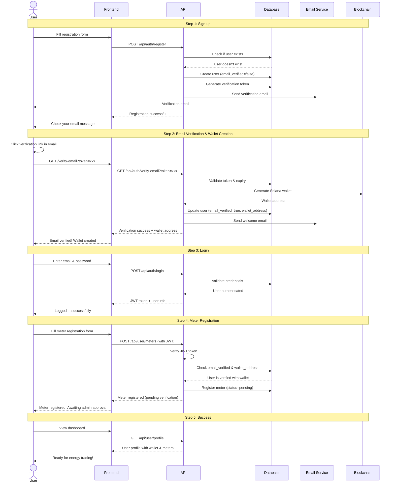

# GridTokenX Registration Flow Documentation

## Overview

This document describes the complete user registration flow for the GridTokenX platform, from initial sign-up through meter owner verification.

## Registration Flow Diagram



## Detailed Flow Steps

### 1. Sign-up (`POST /api/auth/register`)

**Purpose**: Create a new user account

**Request Body**:

```json
{
  "username": "john_doe",
  "email": "john.doe@example.com",
  "password": "SecurePassword123!",
  "first_name": "John",
  "last_name": "Doe"
}
```

**Response** (201 Created):

```json
{
  "message": "Registration successful! Please check your email to verify your account.",
  "email_verification_sent": true
}
```

**What Happens**:

1. Validates input data (username length, email format, password strength)
2. Checks if username or email already exists
3. Hashes password using secure algorithm
4. Creates user record with `email_verified = false`
5. Generates verification token (expires in 24 hours)
6. Sends verification email
7. Logs registration activity

**Error Responses**:

- `400 Bad Request`: Validation error or user already exists
- `500 Internal Server Error`: Failed to send verification email

---

### 2. Email Verification (`GET /api/auth/verify-email?token={token}`)

**Purpose**: Verify email address and automatically create Solana wallet

**Query Parameters**:

- `token`: Email verification token (from email link)

**Response** (200 OK):

```json
{
  "message": "Email verified successfully! Your Solana wallet has been created.",
  "email_verified": true,
  "verified_at": "2024-01-15T10:30:00Z",
  "wallet_address": "5KQwrPbwdL6PhXujxW37FSSQZ1JiwsST4cqQzDeyXtP8",
  "auth": {
    "access_token": "eyJhbGciOiJIUzI1NiIsInR5cCI6IkpXVCJ9...",
    "token_type": "Bearer",
    "expires_in": 3600,
    "user": {
      "username": "john_doe",
      "email": "john.doe@example.com",
      "role": "user",
      "blockchain_registered": true
    }
  }
}
```

**What Happens**:

1. Validates token format and existence
2. Checks if token has expired
3. Checks if email is already verified
4. **Generates new Solana wallet keypair**
5. Updates user: `email_verified = true`, assigns `wallet_address`
6. Clears verification token (one-time use)
7. Logs email verification and wallet creation
8. Sends welcome email
9. Optionally returns JWT for immediate login

**Error Responses**:

- `400 Bad Request`: Invalid or expired token, already verified
- `410 Gone`: Token expired

> [!IMPORTANT]
> The wallet is **automatically created** during email verification. Users don't need to connect an external wallet at this stage.

---

### 3. Login (`POST /api/auth/login`)

**Purpose**: Authenticate user and receive JWT token

**Request Body**:

```json
{
  "email": "john.doe@example.com",
  "password": "SecurePassword123!"
}
```

**Response** (200 OK):

```json
{
  "access_token": "eyJhbGciOiJIUzI1NiIsInR5cCI6IkpXVCJ9...",
  "token_type": "Bearer",
  "expires_in": 3600,
  "user": {
    "username": "john_doe",
    "email": "john.doe@example.com",
    "role": "user",
    "blockchain_registered": true
  }
}
```

**What Happens**:

1. Validates email and password
2. Checks if user account is active
3. Verifies email is confirmed
4. Generates JWT token with user claims
5. Logs login activity

**Error Responses**:

- `401 Unauthorized`: Invalid credentials
- `403 Forbidden`: Email not verified or account inactive

---

### 4. Meter Registration (`POST /api/user/meters`)

**Purpose**: Register a smart meter for energy trading

**Request Headers**:

```
Authorization: Bearer {jwt_token}
```

**Request Body**:

```json
{
  "meter_serial": "METER-12345-ABC",
  "meter_type": "residential",
  "location_address": "123 Main St, City, Country"
}
```

**Response** (201 Created):

```json
{
  "meter_id": "550e8400-e29b-41d4-a716-446655440000",
  "meter_serial": "METER-12345-ABC",
  "wallet_address": "5KQwrPbwdL6PhXujxW37FSSQZ1JiwsST4cqQzDeyXtP8",
  "verification_status": "pending",
  "message": "Meter registered successfully. Status is pending until verified by admin."
}
```

**What Happens**:

1. Validates JWT token
2. **Checks email is verified** (required)
3. **Checks wallet address exists** (required)
4. Validates meter serial and type
5. Checks if meter is already registered
6. Creates meter record with `status = pending`
7. Logs meter registration activity

**Meter Types**:

- `residential`: Home energy meters
- `commercial`: Business energy meters
- `solar`: Solar panel production meters
- `industrial`: Industrial facility meters

**Error Responses**:

- `400 Bad Request`: Invalid data or meter already registered
- `401 Unauthorized`: Invalid or missing JWT token
- `403 Forbidden`: Email not verified or wallet not assigned

> [!WARNING]
> Both email verification AND wallet address are required before meter registration. This ensures proper user identity and blockchain integration.

---

### 5. Success State

Once all steps are complete, the user has:

✅ **Verified email address**  
✅ **Solana wallet address** (auto-generated)  
✅ **Registered smart meter(s)** (pending admin verification)  
✅ **Active account** ready for energy trading

**Next Steps**:

- Admin verifies meter ownership
- User can start submitting energy readings
- User can participate in energy trading marketplace

## Security Considerations

### Password Security

- Minimum 8 characters required
- Hashed using secure algorithm (bcrypt/argon2)
- Never stored in plain text

### Email Verification

- Tokens expire after 24 hours (configurable)
- One-time use tokens (invalidated after verification)
- Rate limiting on resend requests (10 seconds cooldown)

### JWT Tokens

- Signed with secret key
- Include user ID, username, and role
- Expire after configured duration (default: 1 hour)
- Must be sent in Authorization header for protected endpoints

### Wallet Security

- Wallets auto-generated server-side
- Private keys securely stored
- Wallet addresses are unique per user
- Cannot register meters without wallet

## Error Handling

### Common Error Codes

| Status Code | Meaning               | Common Causes                                  |
| ----------- | --------------------- | ---------------------------------------------- |
| 400         | Bad Request           | Validation error, duplicate user, invalid data |
| 401         | Unauthorized          | Invalid credentials, missing JWT token         |
| 403         | Forbidden             | Email not verified, account inactive           |
| 404         | Not Found             | User or resource doesn't exist                 |
| 429         | Too Many Requests     | Rate limit exceeded on verification emails     |
| 500         | Internal Server Error | Database error, email service failure          |

### Error Response Format

```json
{
  "error": "BadRequest",
  "message": "Username or email already exists",
  "details": {
    "field": "email",
    "reason": "duplicate"
  }
}
```

## Rate Limiting

- **Verification Email Resend**: 10 seconds between requests
- **Login Attempts**: Standard rate limiting applies
- **API Requests**: Per-user rate limits on authenticated endpoints

## Configuration

Key configuration parameters (from `config.toml` or environment):

```toml
[email]
verification_enabled = true
verification_expiry_hours = 24
auto_login_after_verification = true

[jwt]
expiration_seconds = 3600
secret_key = "your-secret-key"

[blockchain]
network = "devnet"  # or "mainnet-beta"
```

## Audit Logging

All major actions are logged for audit purposes:

- `user_registered`: User account created
- `email_verification_sent`: Verification email sent
- `email_verified`: Email successfully verified
- `wallet_created`: Blockchain wallet generated
- `meter_registered`: Smart meter registered
- `login`: User login event

## Additional Endpoints

### Resend Verification Email

```http
POST /api/auth/resend-verification
Content-Type: application/json

{
  "email": "john.doe@example.com"
}
```

### Get User Profile

```http
GET /api/user/profile
Authorization: Bearer {jwt_token}
```

### Get Registered Meters

```http
GET /api/meters/registered?status=pending&page=1&page_size=20
Authorization: Bearer {jwt_token}
```

## Testing

See [Integration Tests Guide](./INTEGRATION_TESTS.md) for comprehensive testing examples.

## Support

For issues or questions:

- Check error messages for specific guidance
- Review audit logs for debugging
- Contact support if verification emails aren't received
- Ensure email service is properly configured

---

**Last Updated**: 2025-12-01  
**Version**: 1.0  
**Maintainer**: GridTokenX Platform Team
