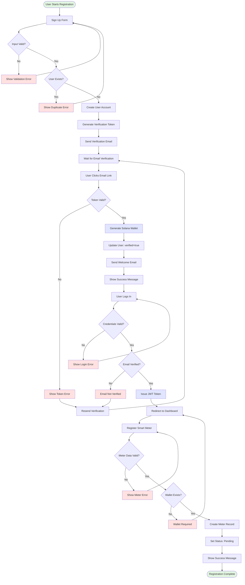
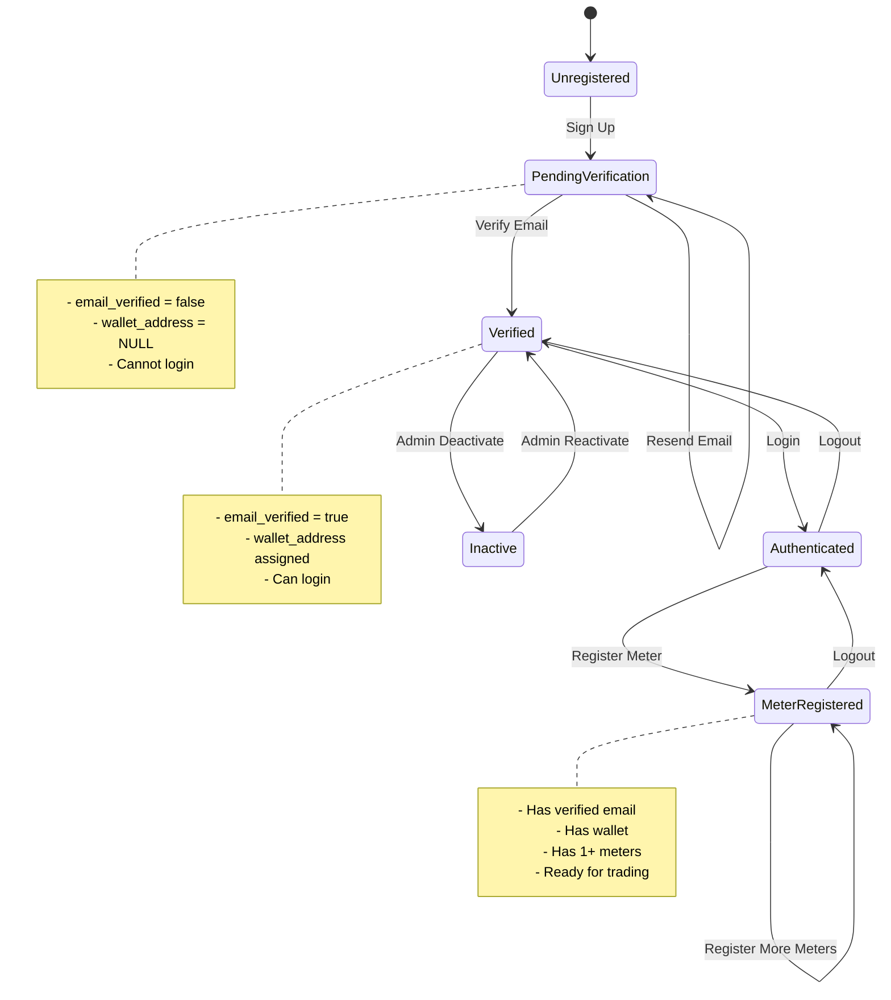
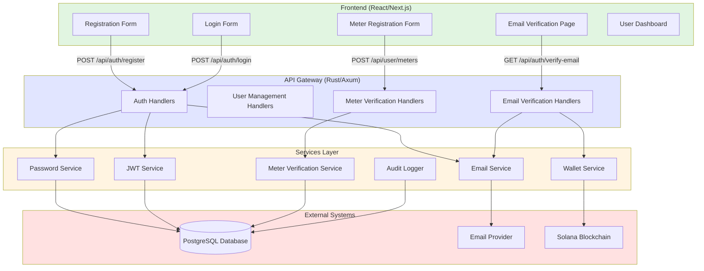
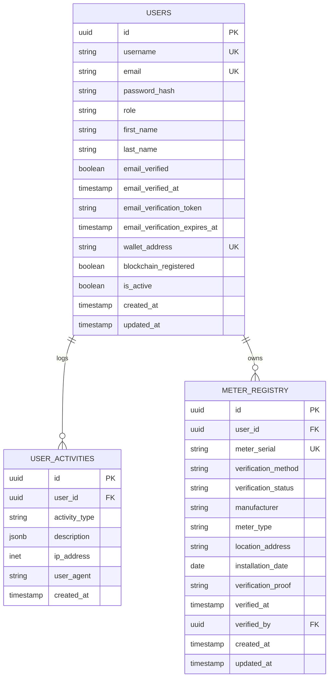
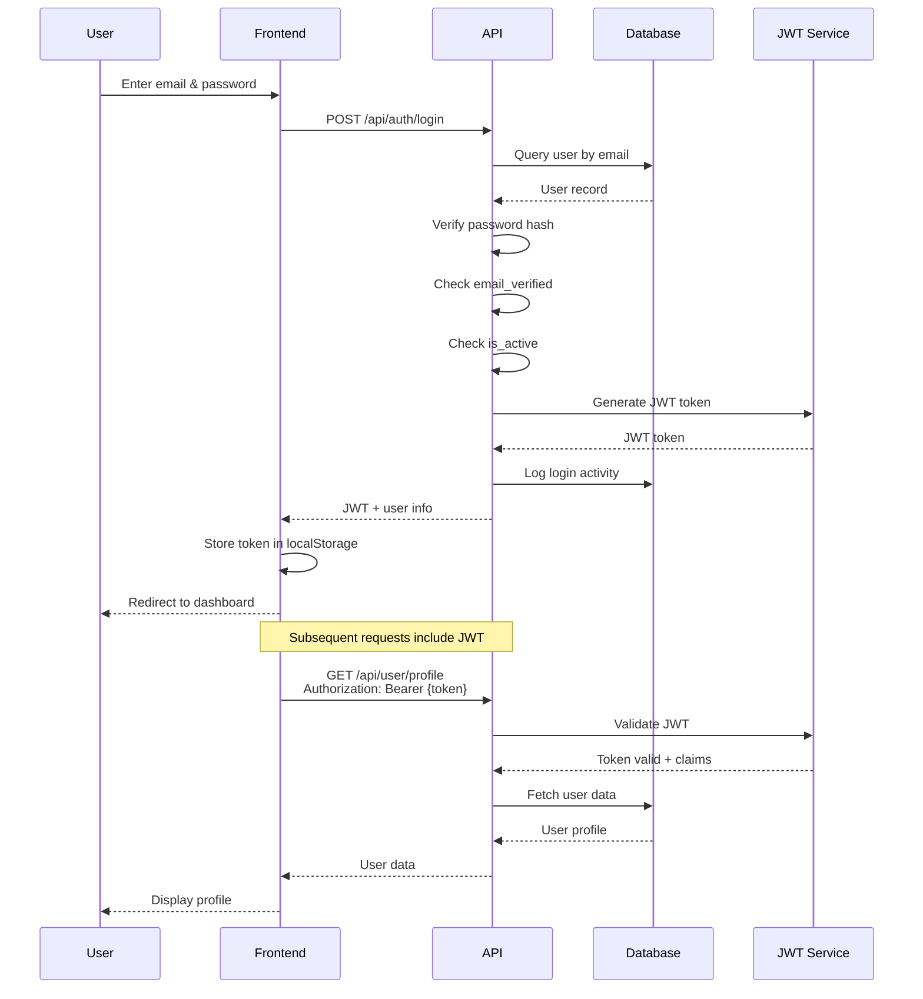
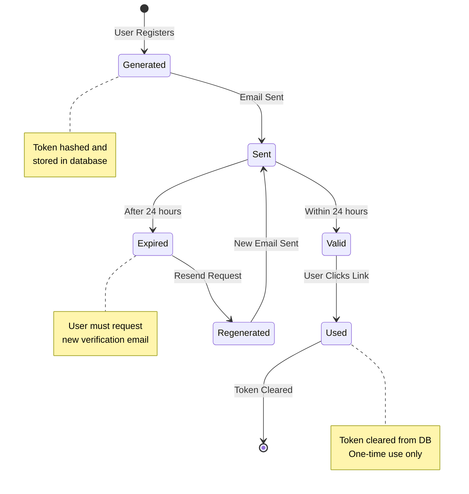
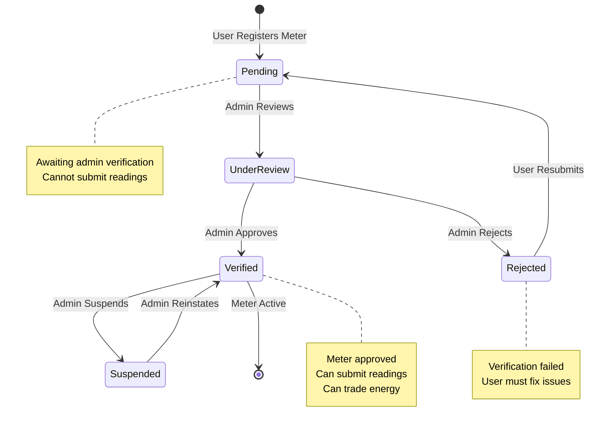
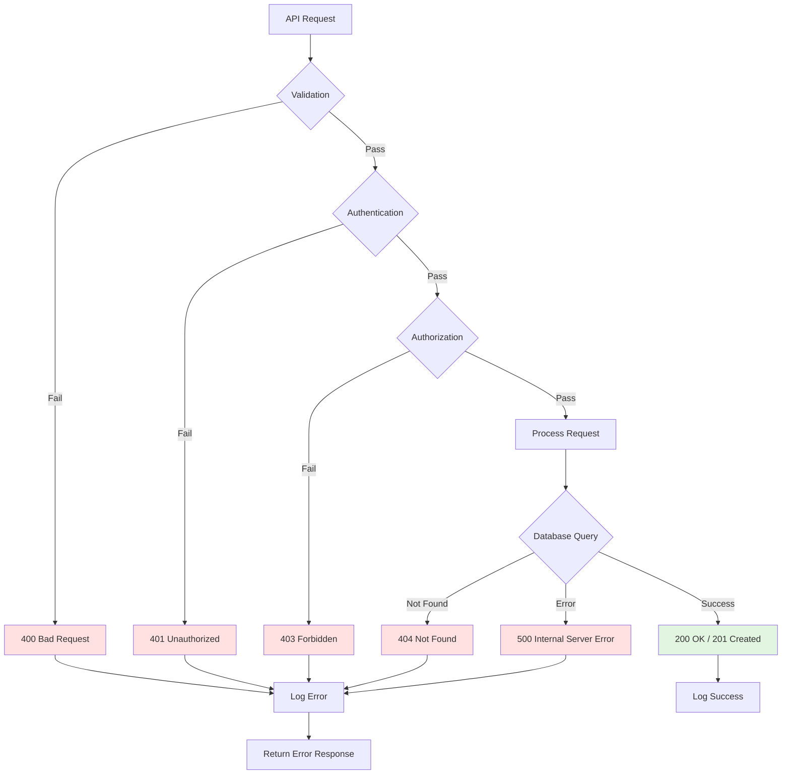

# Visual Flow Diagrams

This document contains visual diagrams for the GridTokenX registration flow.

## 1. High-Level Registration Flow



---

## 2. State Diagram: User Account States



---

## 3. Component Architecture



---

## 4. Database Schema Relationships



---

## 5. Authentication Flow



---

## 6. Email Verification Token Lifecycle



---

## 7. Meter Verification Status Flow



---

## 8. Error Handling Flow



---

## 9. Complete Registration Timeline

```mermaid
gantt
    title Registration Flow Timeline
    dateFormat YYYY-MM-DD HH:mm

    section Sign Up
    Fill form           :a1, 2024-01-01 10:00, 2m
    Submit registration :a2, after a1, 1m
    Receive email       :a3, after a2, 30s

    section Email Verification
    Check email         :b1, 2024-01-01 10:15, 5m
    Click link          :b2, after b1, 30s
    Wallet created      :b3, after b2, 2s

    section Login
    Navigate to login   :c1, 2024-01-01 10:25, 1m
    Enter credentials   :c2, after c1, 1m
    Receive JWT         :c3, after c2, 1s

    section Meter Registration
    Fill meter form     :d1, 2024-01-01 10:30, 3m
    Submit meter        :d2, after d1, 1s
    Meter pending       :d3, after d2, 1s

    section Admin Verification
    Admin reviews       :e1, 2024-01-01 14:00, 1h
    Meter approved      :e2, after e1, 1s
```

---

## 10. Security Layers

```mermaid
graph LR
    subgraph Input["Input Layer"]
        I1[User Input]
    end

    subgraph Validation["Validation Layer"]
        V1[Schema Validation]
        V2[Format Validation]
        V3[Business Rules]
    end

    subgraph Auth["Authentication Layer"]
        A1[Password Verification]
        A2[JWT Validation]
        A3[Email Verification]
    end

    subgraph Authz["Authorization Layer"]
        Z1[Role Check]
        Z2[Resource Ownership]
        Z3[Permission Check]
    end

    subgraph Data["Data Layer"]
        D1[SQL Injection Prevention]
        D2[Parameterized Queries]
        D3[Encrypted Storage]
    end

    I1 --> V1
    V1 --> V2
    V2 --> V3
    V3 --> A1
    A1 --> A2
    A2 --> A3
    A3 --> Z1
    Z1 --> Z2
    Z2 --> Z3
    Z3 --> D1
    D1 --> D2
    D2 --> D3

    style Input fill:#ffe1e1
    style Validation fill:#fff4e1
    style Auth fill:#e1e5ff
    style Authz fill:#e1f5ff
    style Data fill:#e1f5e1
```



---

## Usage

These diagrams can be:

- Embedded in documentation
- Used for presentations
- Shared with stakeholders
- Referenced during development
- Included in API documentation

All diagrams are created using Mermaid syntax and will render automatically in:

- GitHub
- GitLab
- Many documentation platforms
- VS Code (with Mermaid extension)

---

**Last Updated**: 2025-12-01  
**Version**: 1.0
