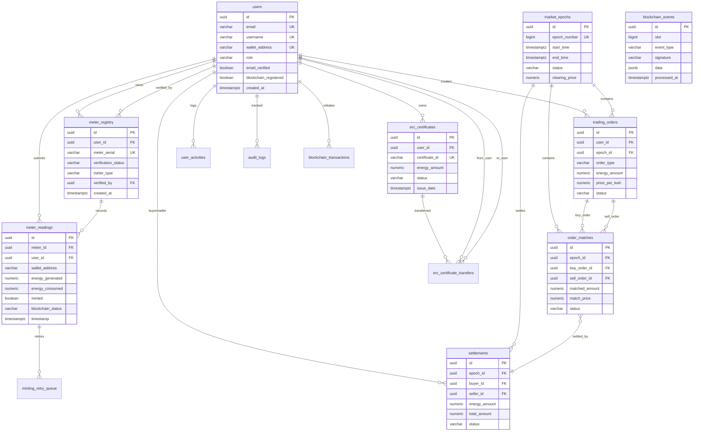

# GridTokenX Database Schema Diagram

## Table Relationships Summary

### Core User Flow
1. **User Registration** → `users` table
2. **Email Verification** → `users.email_verified = true`
3. **Wallet Setup** → `users.wallet_address`
4. **Meter Registration** → `meter_registry` (pending)
5. **Admin Verification** → `meter_registry.verification_status = verified`
6. **Submit Readings** → `meter_readings`
7. **Token Minting** → `meter_readings.minted = true`

### Trading Flow
1. **Create Order** → `trading_orders`
2. **Epoch Processing** → `market_epochs`
3. **Order Matching** → `order_matches`
4. **Settlement** → `settlements`
5. **Blockchain Tx** → `blockchain_transactions`

### Certificate Flow
1. **Issue Certificate** → `erc_certificates`
2. **Transfer** → `erc_certificate_transfers`
3. **Retire** → `erc_certificates.status = retired`

## Key Indexes

### Performance-Critical Indexes

**users**:
- `idx_users_email` (login)
- `idx_users_wallet` (blockchain lookup)
- `idx_users_email_verified` (verification check)

**meter_readings**:
- `idx_meter_readings_wallet` (user queries)
- `idx_meter_readings_timestamp` (time-based queries)
- `idx_meter_readings_blockchain_status` (processing)

**trading_orders**:
- `idx_trading_orders_epoch` (epoch queries)
- `idx_trading_orders_status` (active orders)
- `idx_trading_orders_user` (user orders)

## Foreign Key Cascade Rules

| Relationship | On Delete | Reason |
|--------------|-----------|--------|
| meter_registry → users | CASCADE | Remove meters when user deleted |
| meter_readings → users | SET NULL | Keep readings for audit |
| meter_readings → meter_registry | SET NULL | Support legacy readings |
| trading_orders → users | CASCADE | Remove orders when user deleted |
| settlements → users | CASCADE | Remove settlements when user deleted |

## Schema Version Control

All migrations tracked in `_sqlx_migrations` table:
- 21 migrations applied
- Sequential versioning
- Checksum validation
- Rollback support (manual)
