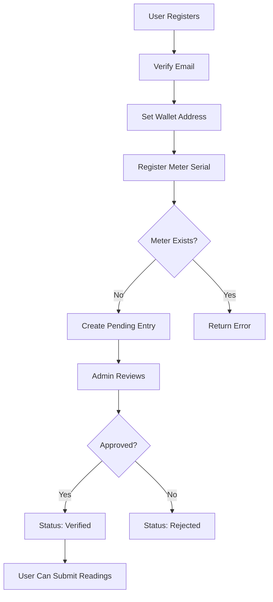

# Meter Registration API Documentation

## Overview

The Meter Registration API allows verified users to register their smart meter serial numbers and associate them with their wallet addresses. This is a simplified registration process that creates pending meter entries for admin verification.

## Prerequisites

Before registering a meter, users must:
1. ✅ Register an account
2. ✅ Verify their email address
3. ✅ Set their wallet address

## Endpoints

### 1. Register Meter

Register a new meter serial number.

**Endpoint**: `POST /api/user/meters`

**Authentication**: Required (Bearer token)

**Request Body**:
```json
{
  "meter_serial": "METER-12345",
  "meter_type": "solar",           // Optional: residential, commercial, solar, industrial
  "location_address": "123 Main St" // Optional
}
```

**Response** (201 Created):
```json
{
  "meter_id": "550e8400-e29b-41d4-a716-446655440000",
  "meter_serial": "METER-12345",
  "wallet_address": "9WzDXwBbmkg8ZTbNMqUxvQRAyrZzDsGYdLVL9zYtAWWM",
  "verification_status": "pending",
  "message": "Meter registered successfully. Status is pending until verified by admin."
}
```

**Validation Rules**:
- `meter_serial`: 5-50 characters, alphanumeric and hyphens only
- Must be unique (not already registered)
- User must have verified email
- User must have wallet address set

**Error Responses**:
- `400` - Invalid request or meter already registered
- `403` - Email not verified or wallet address not set
- `401` - Unauthorized

---

### 2. List User's Meters

Get all meters registered by the current user.

**Endpoint**: `GET /api/user/meters`

**Authentication**: Required (Bearer token)

**Response** (200 OK):
```json
{
  "meters": [
    {
      "meter_id": "550e8400-e29b-41d4-a716-446655440000",
      "meter_serial": "METER-12345",
      "wallet_address": "9WzDXwBbmkg8ZTbNMqUxvQRAyrZzDsGYdLVL9zYtAWWM",
      "verification_status": "pending",
      "meter_type": "solar",
      "location_address": "123 Main St",
      "created_at": "2025-11-28T03:00:00Z"
    }
  ],
  "total": 1
}
```

---

### 3. Delete Pending Meter

Remove a meter registration (only allowed for pending meters).

**Endpoint**: `DELETE /api/user/meters/{meter_id}`

**Authentication**: Required (Bearer token)

**Response** (204 No Content)

**Error Responses**:
- `400` - Cannot delete verified meters
- `403` - Not meter owner
- `404` - Meter not found
- `401` - Unauthorized

---

## Usage Examples

### Complete Registration Flow

```bash
# 1. Register user
curl -X POST http://localhost:8080/api/auth/register \
  -H "Content-Type: application/json" \
  -d '{
    "username": "john_doe",
    "email": "john@example.com",
    "password": "SecurePassword123!",
    "first_name": "John",
    "last_name": "Doe"
  }'

# 2. Verify email (manual DB update for testing)
docker exec gridtokenx-postgres psql -U gridtokenx -d gridtokenx -c \
  "UPDATE users SET email_verified = true WHERE email = 'john@example.com';"

# 3. Login
TOKEN=$(curl -s -X POST http://localhost:8080/api/auth/login \
  -H "Content-Type: application/json" \
  -d '{
    "username": "john_doe",
    "password": "SecurePassword123!"
  }' | jq -r '.access_token')

# 4. Set wallet address
curl -X POST http://localhost:8080/api/user/wallet \
  -H "Authorization: Bearer $TOKEN" \
  -H "Content-Type: application/json" \
  -d '{
    "wallet_address": "9WzDXwBbmkg8ZTbNMqUxvQRAyrZzDsGYdLVL9zYtAWWM"
  }'

# 5. Register meter
curl -X POST http://localhost:8080/api/user/meters \
  -H "Authorization: Bearer $TOKEN" \
  -H "Content-Type: application/json" \
  -d '{
    "meter_serial": "METER-12345",
    "meter_type": "solar",
    "location_address": "123 Main Street"
  }'

# 6. List meters
curl http://localhost:8080/api/user/meters \
  -H "Authorization: Bearer $TOKEN"

# 7. Delete meter (if needed)
curl -X DELETE http://localhost:8080/api/user/meters/{meter_id} \
  -H "Authorization: Bearer $TOKEN"
```

---

## Database Schema

Meters are stored in the `meter_registry` table:

```sql
CREATE TABLE meter_registry (
    id UUID PRIMARY KEY,
    user_id UUID REFERENCES users(id),
    meter_serial VARCHAR(255) UNIQUE,
    meter_key_hash VARCHAR(255),  -- Empty for simple registration
    verification_method VARCHAR(50) DEFAULT 'serial',
    verification_status VARCHAR(20) DEFAULT 'pending',
    meter_type VARCHAR(50),
    location_address TEXT,
    created_at TIMESTAMP,
    updated_at TIMESTAMP
);
```

**Verification Status Values**:
- `pending` - Awaiting admin verification
- `verified` - Approved by admin
- `rejected` - Rejected by admin
- `suspended` - Temporarily suspended

---

## Workflow



---

## Error Handling

| Error | Status | Message |
|-------|--------|---------|
| Email not verified | 403 | "Email verification required before registering meters" |
| No wallet address | 400 | "Wallet address must be set before registering meters" |
| Duplicate meter | 400 | "Meter serial 'XXX' is already registered" |
| Invalid format | 400 | "Meter serial must be between 5 and 50 characters long" |
| Not owner | 403 | "You do not own this meter" |
| Cannot delete verified | 400 | "Cannot delete verified meters. Only pending meters can be deleted." |

---

## Testing

Run the integration test script:

```bash
cd /Users/chanthawat/Developments/gridtokenx-platform/gridtokenx-apigateway
./scripts/test-meter-registration.sh
```

---

## Next Steps

After registering a meter:
1. Wait for admin verification
2. Once verified, submit meter readings via `/api/meters/submit-reading`
3. Readings will be tokenized based on energy generated

---

**Feature Status**: ✅ Implemented  
**API Version**: 1.0.0  
**Last Updated**: 2025-11-28
