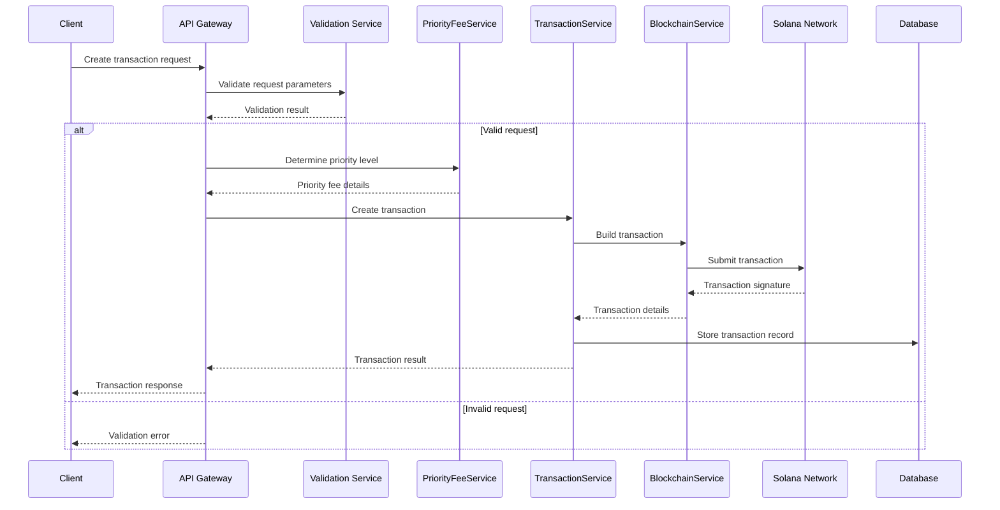

# Plan for Creating Transactions from API Gateway to Blockchain

## Overview

This document outlines a comprehensive plan for implementing transaction creation from the GridTokenX API Gateway to the Solana blockchain. The plan builds upon the existing infrastructure while adding sophisticated transaction capabilities optimized for the Solana network.

## Current Transaction Architecture Analysis

The system already has a solid foundation with:

- `TransactionService`: A service with basic implementations for submitting transactions, checking status, creating trading transactions, and minting transactions
- `BlockchainService`: A comprehensive service for interacting with Solana blockchain, including building and sending transactions, minting tokens, and more
- `SettlementService`: Handles trade settlements and executes blockchain transfers
- Priority fee optimization through `PriorityFeeService`
- API endpoints for transaction submission and monitoring

### Current Limitations

1. Simplified transaction creation without network condition awareness
2. Limited retry mechanisms
3. Static priority fee recommendations
4. Basic transaction monitoring
5. No transaction batching capabilities

## Proposed Transaction Creation Flow

### Transaction Lifecycle



## Transaction Types and Specialization

Based on the existing code, we recommend specializing transaction creation for these types:

1. **Energy Trading Transactions** (Order creation, matching, settlement)
2. **Token Minting Transactions** (Energy token creation and distribution)
3. **ERC Certificate Transactions** (Energy Renewable Certificate issuance)
4. **Registry Transactions** (User and meter registration)
5. **Oracle Transactions** (Energy reading submissions)

### Transaction Priority Matrix

| Transaction Type | Priority | Compute Units | Estimated Fee (SOL) | Confirmation Time |
|------------------|----------|---------------|---------------------|-------------------|
| Settlement       | High     | 300,000       | 0.015               | ~8 seconds (2 slots) |
| Token Minting    | Medium   | 150,000       | 0.003               | ~20 seconds (5 slots) |
| ERC Issuance     | Medium   | 250,000       | 0.005               | ~20 seconds (5 slots) |
| Order Creation   | Low      | 100,000       | 0.0002              | ~40 seconds (10 slots) |
| Wallet Connection| Low      | 50,000        | 0.0001              | ~40 seconds (10 slots) |

## Enhanced Transaction Service Implementation

### Core Components

```rust
pub struct EnhancedTransactionService {
    blockchain_service: BlockchainService,
    priority_fee_service: DynamicPriorityFeeService,
    retry_service: TransactionRetryService,
    queue_service: TransactionQueue,
    monitoring_service: TransactionMonitoringService,
}

impl EnhancedTransactionService {
    pub async fn create_specialized_transaction<T>(
        &self,
        request: T,
        user_id: &str,
        transaction_type: TransactionType
    ) -> Result<TransactionResult, ApiError>
    where T: TransactionRequest {
        // Implementation for specialized transaction creation
    }
    
    pub async fn submit_with_optimal_fees(
        &self,
        transaction: &str,
        transaction_type: TransactionType,
        urgency: UrgencyLevel
    ) -> Result<TransactionResult, ApiError> {
        // Implementation with dynamic fee optimization
    }
    
    pub async fn batch_submit(
        &self,
        transactions: Vec<BatchableTransaction>
    ) -> Result<Vec<TransactionResult>, ApiError> {
        // Implementation for batch submission
    }
}
```

### Transaction Request Models

```rust
pub trait TransactionRequest: Serialize + Deserialize + Validate {
    fn transaction_type(&self) -> TransactionType;
    fn required_signatures(&self) -> Vec<String>;
    fn accounts_involved(&self) -> Vec<String>;
}

pub struct TradingTransactionRequest {
    pub order_id: Uuid,
    pub trade_amount: rust_decimal::Decimal,
    pub price_per_unit: rust_decimal::Decimal,
    pub buyer_wallet: String,
    pub seller_wallet: String,
    pub urgency: UrgencyLevel,
}

pub struct MintTransactionRequest {
    pub recipient: String,
    pub amount_kwh: rust_decimal::Decimal,
    pub meter_id: Uuid,
    pub urgency: UrgencyLevel,
}
```

## Priority Fee Optimization

### Dynamic Priority Fee Service

```rust
pub struct DynamicPriorityFeeService {
    client: RpcClient,
    base_service: PriorityFeeService,
    market_conditions_cache: Arc<RwLock<MarketConditions>>,
}

impl DynamicPriorityFeeService {
    pub async fn get_optimal_priority_fee(
        &self,
        transaction_type: TransactionType,
        urgency: UrgencyLevel
    ) -> Result<PriorityFeeEstimate, ApiError> {
        // Get recent fees from network
        let recent_fees = self.get_recent_priority_fees().await?;
        
        // Get network congestion level
        let congestion_level = self.get_network_congestion().await?;
        
        // Calculate optimal fee based on conditions
        let base_fee = self.base_service.recommend_priority_level(transaction_type);
        
        let adjusted_fee = match urgency {
            UrgencyLevel::Low => base_fee,
            UrgencyLevel::Medium => base_fee.adjust_for_congestion(congestion_level),
            UrgencyLevel::High => base_fee.adjust_for_congestion_and_time(congestion_level),
        };
        
        Ok(PriorityFeeEstimate {
            micro_lamports_per_cu: adjusted_fee.micro_lamports_per_cu(),
            estimated_confirmation_slots: adjusted_fee.estimated_slots(),
            cost_sol: adjusted_fee.micro_lamports_per_cu() as f64 * 200_000.0 / 1_000_000_000.0,
            confidence: self.calculate_confidence(recent_fees, adjusted_fee),
        })
    }
}
```

### Market Conditions Tracking

```rust
pub struct MarketConditions {
    pub recent_priority_fees: Vec<u64>,
    pub average_tps: f64,
    pub pending_tx_count: u64,
    pub last_updated: DateTime<Utc>,
    pub congestion_level: CongestionLevel,
}

pub enum CongestionLevel {
    Low,
    Medium,
    High,
    Extreme,
}
```

## Error Handling and Retry Logic

### Enhanced Retry Service

```rust
pub struct EnhancedRetryService {
    config: RetryConfig,
    backoff_strategy: BackoffStrategy,
    circuit_breaker: CircuitBreaker,
}

pub struct RetryConfig {
    pub max_retries: u32,
    pub base_delay: Duration,
    pub max_delay: Duration,
    pub backoff_multiplier: f32,
    pub retry_on_error_types: Vec<ErrorType>,
    pub retryable_transaction_types: Vec<TransactionType>,
}

pub enum BackoffStrategy {
    Linear,
    Exponential,
    Fibonacci,
}

pub struct CircuitBreaker {
    failure_threshold: u32,
    timeout: Duration,
    state: CircuitState,
}

pub enum CircuitState {
    Closed,
    Open,
    HalfOpen,
}
```

### Transaction Recovery

```rust
impl EnhancedTransactionService {
    pub async fn recover_stuck_transactions(&self) -> Result<Vec<TransactionResult>, ApiError> {
        // Find transactions that haven't confirmed within expected time
        let stuck_transactions = self
            .database
            .find_stuck_transactions(Duration::from_secs(60))
            .await?;
        
        let mut results = Vec::new();
        
        for tx in stuck_transactions {
            match self.recover_transaction(&tx).await {
                Ok(result) => results.push(result),
                Err(e) => {
                    tracing::error!("Failed to recover transaction {}: {}", tx.signature, e);
                    // Log for manual intervention
                }
            }
        }
        
        Ok(results)
    }
    
    async fn recover_transaction(&self, tx: &PendingTransaction) -> Result<TransactionResult, ApiError> {
        // Check if transaction is already confirmed on-chain
        let status = self.blockchain_service.get_signature_status(&tx.signature).await?;
        
        if status.is_confirmed() {
            // Update database and return success
            return self.mark_transaction_confirmed(tx).await;
        }
        
        // Check if we should replace with higher fees
        if tx.age() > Duration::from_secs(30) {
            return self.replace_transaction_with_higher_fees(tx).await;
        }
        
        // Otherwise, just retry
        self.retry_service.retry_transaction(&tx.signature).await
    }
}
```

## Transaction Monitoring and Analytics

### Monitoring Service

```rust
pub struct TransactionMonitoringService {
    analytics: TransactionAnalytics,
    alerting: AlertingService,
    dashboard: DashboardService,
}

impl TransactionMonitoringService {
    pub async fn monitor_transaction_lifecycle(
        &self,
        signature: &str,
        user_id: &str,
    ) -> Result<TransactionLifecycle, ApiError> {
        // Monitor from submission to final confirmation
        let lifecycle = TransactionLifecycle {
            signature: signature.to_string(),
            user_id: user_id.to_string(),
            stages: self.collect_transaction_stages(signature).await?,
            current_stage: TransactionStage::Pending,
            started_at: Utc::now(),
            last_updated: Utc::now(),
        };
        
        Ok(lifecycle)
    }
    
    pub async fn track_performance_metrics(&self) -> Result<PerformanceMetrics, ApiError> {
        let metrics = PerformanceMetrics {
            average_confirmation_time: self.analytics.get_avg_confirmation_time().await?,
            transaction_success_rate: self.analytics.get_success_rate().await?,
            total_transactions_per_hour: self.analytics.get_transaction_volume().await?,
            average_priority_fee: self.analytics.get_avg_priority_fee().await?,
            most_common_failure_reasons: self.analytics.get_failure_reasons().await?,
        };
        
        Ok(metrics)
    }
}
```

### Analytics Dashboard

```rust
pub struct AnalyticsDashboard {
    metrics_collector: MetricsCollector,
    data_aggregator: DataAggregator,
    report_generator: ReportGenerator,
}

impl AnalyticsDashboard {
    pub async fn generate_realtime_dashboard(&self) -> Result<DashboardData, ApiError> {
        Ok(DashboardData {
            transaction_volume_chart: self.get_transaction_volume().await?,
            confirmation_time_distribution: self.get_confirmation_distribution().await?,
            success_rate_by_type: self.get_success_rate_by_type().await?,
            fee_trends: self.get_fee_trends().await?,
            error_breakdown: self.get_error_breakdown().await?,
        })
    }
    
    pub async fn generate_periodic_report(
        &self,
        period: ReportPeriod
    ) -> Result<TransactionReport, ApiError> {
        // Generate comprehensive report for the specified period
        let report = TransactionReport {
            period,
            summary: self.generate_summary(period).await?,
            detailed_metrics: self.get_detailed_metrics(period).await?,
            recommendations: self.generate_recommendations().await?,
        };
        
        Ok(report)
    }
}
```

## Transaction Batching and Optimization

### Batching Service

```rust
pub struct TransactionBatchingService {
    max_batch_size: usize,
    max_wait_time: Duration,
    pending_batches: HashMap<TransactionType, PendingBatch>,
}

impl TransactionBatchingService {
    pub async fn add_to_batch(
        &mut self,
        transaction: BatchableTransaction
    ) -> Result<Option<String>, ApiError> {
        let batch_type = transaction.transaction_type();
        
        if let Some(batch) = self.pending_batches.get_mut(&batch_type) {
            batch.add_transaction(transaction);
            
            if batch.is_full() || batch.is_expired() {
                return self.submit_batch(batch_type).await;
            }
        } else {
            self.pending_batches.insert(
                batch_type,
                PendingBatch::new(
                    transaction,
                    self.max_batch_size,
                    self.max_wait_time
                )
            );
        }
        
        Ok(None) // Transaction queued, not yet submitted
    }
    
    async fn submit_batch(&mut self, batch_type: TransactionType) -> Result<String, ApiError> {
        let batch = self.pending_batches.remove(&batch_type)
            .ok_or_else(|| ApiError::Internal("Batch not found".to_string()))?;
        
        // Create a batch transaction
        let batch_signature = self.create_batch_transaction(batch.transactions()).await?;
        
        // Track individual transaction status within the batch
        for tx_id in batch.transaction_ids() {
            self.database.track_batch_transaction(tx_id, &batch_signature).await?;
        }
        
        Ok(batch_signature)
    }
}
```

### Transaction Dependency Management

```rust
pub struct TransactionDependencyManager {
    dependency_graph: HashMap<String, Vec<String>>,
    pending_transactions: HashMap<String, PendingTransaction>,
}

impl TransactionDependencyManager {
    pub async fn submit_with_dependencies(
        &mut self,
        transaction: PendingTransaction,
        dependencies: Vec<String>
    ) -> Result<String, ApiError> {
        let tx_id = transaction.id.clone();
        
        // Check if all dependencies are satisfied
        if self.are_dependencies_satisfied(&dependencies).await? {
            // Submit immediately
            let signature = self.submit_transaction(transaction).await?;
            self.mark_as_submitted(&tx_id, &signature).await?;
            return Ok(signature);
        }
        
        // Queue with dependencies
        self.pending_transactions.insert(tx_id.clone(), transaction);
        self.dependency_graph.insert(tx_id.clone(), dependencies);
        
        Ok("queued".to_string())
    }
    
    pub async fn on_transaction_confirmed(&mut self, signature: &str) -> Result<(), ApiError> {
        // Find all transactions that depend on this one
        let ready_transactions = self.find_ready_transactions(signature).await?;
        
        // Submit all ready transactions
        for tx_id in ready_transactions {
            if let Some(transaction) = self.pending_transactions.remove(&tx_id) {
                let tx_signature = self.submit_transaction(transaction).await?;
                self.mark_as_submitted(&tx_id, &tx_signature).await?;
            }
        }
        
        Ok(())
    }
}
```

## Implementation Plan

### Phase 1: Enhanced Transaction Creation Service (Week 1-2)

1. **Create new enhanced transaction service**
   - Integrate existing `BlockchainService` and `PriorityFeeService`
   - Implement specialized transaction creation for each type
   - Add comprehensive error handling

2. **Update API endpoints**
   - Refactor existing blockchain handlers to use new service
   - Add type-specific transaction creation endpoints
   - Enhance request/response models

3. **Database schema updates**
   - Add transaction metadata fields
   - Create transaction type-specific tables if needed
   - Add indexes for performance

### Phase 2: Priority Fee Optimization (Week 3)

1. **Implement dynamic priority fee calculation**
   - Monitor network conditions in real-time
   - Adjust fees based on transaction urgency and network load
   - Cache market conditions to reduce RPC calls

2. **Add priority fee estimation API**
   - Allow clients to preview fees before submission
   - Provide multiple priority options (slow, medium, fast)
   - Include estimated confirmation times

### Phase 3: Enhanced Monitoring and Analytics (Week 4)

1. **Implement comprehensive monitoring**
   - Track transaction lifecycle from submission to confirmation
   - Add alerts for stuck transactions
   - Create analytics dashboard for transaction performance

2. **Add transaction batching capabilities**
   - Group similar transactions for efficiency
   - Optimize for lower fees when possible
   - Maintain ordering for dependent transactions

### Phase 4: Advanced Features (Week 5-6)

1. **Implement transaction replacement**
   - Allow replacing stuck transactions with higher fees
   - Implement transaction cancellation when appropriate
   - Add transaction acceleration features

2. **Add transaction simulation**
   - Allow clients to simulate transactions before submission
   - Estimate gas costs and potential outcomes
   - Validate transaction parameters before signing

## Security Considerations

### Transaction Validation

```rust
pub struct TransactionValidator {
    max_transaction_size: usize,
    allowed_program_ids: HashSet<String>,
    rate_limiter: RateLimiter,
}

impl TransactionValidator {
    pub async fn validate_transaction(
        &self,
        transaction: &str,
        user_id: &str
    ) -> Result<ValidationResult, ApiError> {
        // Check size limits
        if transaction.len() > self.max_transaction_size {
            return Err(ApiError::BadRequest("Transaction too large".to_string()));
        }
        
        // Check rate limits
        if !self.rate_limiter.check_limit(user_id).await {
            return Err(ApiError::TooManyRequests("Rate limit exceeded".to_string()));
        }
        
        // Parse transaction and validate structure
        let parsed_tx = self.parse_and_validate_structure(transaction).await?;
        
        // Check program IDs against allowlist
        for instruction in parsed_tx.message.instructions {
            let program_id = parsed_tx.message.account_keys[instruction.program_id_index as usize];
            if !self.allowed_program_ids.contains(&program_id.to_string()) {
                return Err(ApiError::BadRequest(
                    format!("Program ID {} not allowed", program_id)
                ));
            }
        }
        
        Ok(ValidationResult::Valid)
    }
}
```

### Access Control

```rust
pub struct TransactionAccessController {
    role_repository: RoleRepository,
    permission_checker: PermissionChecker,
}

impl TransactionAccessController {
    pub async fn can_submit_transaction(
        &self,
        user_id: &str,
        transaction_type: TransactionType
    ) -> Result<bool, ApiError> {
        // Get user roles
        let roles = self.role_repository.get_user_roles(user_id).await?;
        
        // Check if any role has permission for this transaction type
        for role in roles {
            if self.permission_checker.has_permission(role, transaction_type).await? {
                return Ok(true);
            }
        }
        
        Ok(false)
    }
}
```

### Audit Trail

```rust
pub struct TransactionAuditor {
    audit_log: AuditLogRepository,
    immutable_store: ImmutableStore,
}

impl TransactionAuditor {
    pub async fn log_transaction_submission(
        &self,
        user_id: &str,
        transaction: &str,
        signature: &str,
        metadata: &TransactionMetadata
    ) -> Result<(), ApiError> {
        let audit_entry = AuditEntry {
            timestamp: Utc::now(),
            event_type: AuditEventType::TransactionSubmission,
            user_id: user_id.to_string(),
            entity_id: signature.to_string(),
            details: json!({
                "transaction_preview": self.create_safe_preview(transaction),
                "metadata": metadata,
            }),
        };
        
        // Store in regular audit log
        self.audit_log.store_entry(audit_entry.clone()).await?;
        
        // Store in immutable storage for compliance
        self.immutable_store.store_entry(audit_entry).await?;
        
        Ok(())
    }
}
```

## Testing Strategy

### Unit Tests

1. **Transaction Creation Tests**
   - Test specialized transaction creation for each type
   - Test parameter validation and error handling
   - Test transaction serialization and deserialization

2. **Priority Fee Tests**
   - Test fee calculation under different network conditions
   - Test fee estimation accuracy
   - Test dynamic fee adjustment

3. **Retry Logic Tests**
   - Test exponential backoff
   - Test circuit breaker behavior
   - Test transaction recovery

### Integration Tests

1. **End-to-End Transaction Flow**
   - Test transaction submission to confirmation
   - Test with actual Solana devnet
   - Test failure scenarios and recovery

2. **Service Integration**
   - Test integration with database
   - Test integration with Redis for caching
   - Test integration with WebSocket notifications

### Load Tests

1. **High Volume Testing**
   - Test system under high transaction volume (1000+ TPS)
   - Test with concurrent transaction submissions
   - Test performance under network congestion

2. **Batching Tests**
   - Test batching efficiency under different loads
   - Test batch submission timing
   - Test batch failure handling

## Deployment Plan

### Blue-Green Deployment

1. **Initial Deployment**
   - Deploy new service alongside existing one
   - Run smoke tests against new deployment
   - Monitor performance metrics

2. **Traffic Shifting**
   - Gradually shift traffic to new implementation (5%, 25%, 50%, 100%)
   - Monitor error rates and latency
   - Prepare rollback plan if issues arise

3. **Final Migration**
   - Complete traffic shift
   - Decommission old implementation
   - Update documentation and monitoring

### Feature Flags

```rust
pub struct TransactionFeatureFlags {
    pub dynamic_priority_fees: bool,
    pub transaction_batching: bool,
    pub advanced_monitoring: bool,
    pub transaction_simulation: bool,
}

pub struct FeatureFlagService {
    flags: HashMap<String, bool>,
}

impl FeatureFlagService {
    pub async fn is_enabled(&self, flag_name: &str) -> bool {
        self.flags.get(flag_name).copied().unwrap_or(false)
    }
    
    pub async fn enable_for_percentage(&mut self, flag_name: &str, percentage: u8) {
        // Enable feature for specified percentage of users
        let hash = |user_id: &str| -> u8 {
            use std::collections::hash_map::DefaultHasher;
            use std::hash::{Hash, Hasher};
            
            let mut hasher = DefaultHasher::new();
            user_id.hash(&mut hasher);
            (hasher.finish() % 100) as u8
        };
        
        // Implementation would check user's hash against percentage
    }
}
```

### Monitoring During Rollout

1. **Key Metrics to Monitor**
   - Transaction success rate
   - Average confirmation time
   - Transaction cost (fees)
   - Error rates by type

2. **Alerts to Configure**
   - Success rate drops below 95%
   - Average confirmation time exceeds expected threshold
   - Error rate increases significantly
   - Pending transaction backlog grows

3. **Dashboard Creation**
   - Real-time transaction monitoring
   - Transaction type breakdown
   - Network condition impact
   - Performance trends over time

## Conclusion

This plan provides a comprehensive roadmap for enhancing the GridTokenX API Gateway's transaction creation capabilities. The phased approach allows for incremental improvements while maintaining system stability.

Key benefits of this implementation:

1. **Improved Transaction Performance** through dynamic fee optimization
2. **Enhanced Reliability** with better error handling and retry logic
3. **Increased Throughput** with transaction batching capabilities
4. **Better User Experience** with transaction simulation and fee estimation
5. **Comprehensive Monitoring** for operational visibility

The implementation builds upon the existing solid foundation while adding sophisticated blockchain transaction management capabilities optimized for the Solana network.